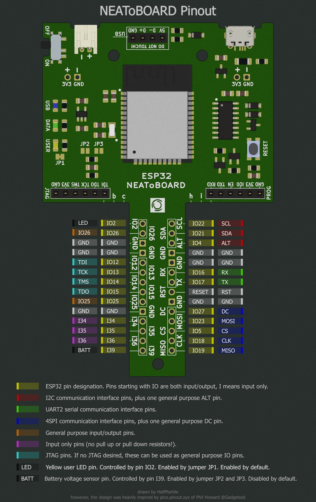

# NEAToBOARD

An open-source **ESP32-WROOM-32 development board** by [halfmarble](https://halfmarble.com), designed in KiCad. NEAToBOARD breaks the ESP32 out onto a breadboard-friendly board with USB, on-board programming, a battery power path, and a built-in set of I/O for learning and prototyping.



## Features

- **ESP32-WROOM-32** module
- **USB micro-B** with a CH340C USB-to-UART bridge and the standard auto-reset / auto-bootloader circuit (no need to press buttons to flash)
- **Reset** and **two general-purpose** push buttons
- **Battery support** — JST-PH VBAT input with a Schottky power-path and a voltage divider for battery sensing, plus a 500 mA resettable fuse
- **32.768 kHz crystal** for the RTC / deep-sleep timekeeping
- On-board I/O for experimentation: a **5×4 LED matrix**, **RGB LED** (WS2812B), and discrete **feedback LEDs**
- **I²C** header plus a **Qwiic** connector, and an **SPI** header
- **JTAG** header for debugging
- M2 mounting holes; panelized with mouse-bite tabs

See the [full schematic (PDF)](docs/NEAToBOARD_ESP32.pdf) and the [pinout diagram](docs/NEAToBOARD_ESP32_pinout.jpg).

## Repository layout

```
hardware/
  KiCad-project/        KiCad 7 project — open NEAToBOARD_ESP32.kicad_pro
    NEAToBOARD_ESP32.kicad_sch        main schematic
    NEAToBOARD_ESP32Extras.kicad_sch  sub-sheet
    NEAToBOARD_ESP32.kicad_pcb        board layout
    HalfMarble.pretty/    project footprint library
    HalfMarble.3dshapes/  project 3D models (.step/.wrl) and symbols
    board2pdf.config.ini  board2pdf plugin config (fabrication PDFs)
    ibom.config.ini       InteractiveHtmlBom plugin config
    bom/                  rendered interactive BOM (bom.html)
    pinout/               pinout artwork source (pinout.pxd)
  3d/
    NEAToBOARD-ESP32.stl  3D-printable model of the board
docs/                   rendered schematic PDF and pinout image
BOM.csv                 bill of materials (values, footprints, manufacturer part numbers)
```

The authoritative source of truth is the KiCad schematic — `BOM.csv` is a convenience export so you can read the parts list without opening KiCad.

## Building / opening the design

Open `hardware/KiCad-project/NEAToBOARD_ESP32.kicad_pro` in **KiCad 7** (the files are saved in the `20221018` format). The custom footprint and 3D-model libraries are bundled inside the project and referenced with `${KIPRJMOD}`, so they load automatically — no global library setup required.

## Firmware

There is no firmware in this repository — NEAToBOARD runs **any ESP32 firmware**. Flash it with your toolchain of choice (Arduino core for ESP32, ESP-IDF, MicroPython, etc.) over the USB port; the on-board auto-reset/auto-bootloader circuit handles entering download mode, so no button presses are needed.

The pin layout is based on the **DFRobot FireBeetle ESP32** (with parts of **Adafruit's ESP32 board**). The simplest path is to target the **FireBeetle ESP32** board definition / pin map — most pins line up. If you select a different board definition, expect to **re-map a few GPIO assignments** to match this board; cross-check against the [pinout diagram](docs/NEAToBOARD_ESP32_pinout.jpg) and the [schematic](docs/NEAToBOARD_ESP32.pdf).

## Defensive publication / prior art

[`docs/defensive-publication/`](docs/defensive-publication/) contains a defensive
publication — *Synchronized Multi-Line Digital Signal Generation Using Plural Independent
Software-Triggered Serializer Peripherals With Open-Loop Fixed Start-Skew Compensation* —
published in the **Technical Disclosure Commons**, Defensive Publications Series
([www.tdcommons.org/dpubs_series/10442](https://www.tdcommons.org/dpubs_series/10442)), an
examiner-searched prior-art database, together with
load-bearing source excerpts. It documents, as dated public prior art, a technique for
synthesizing a USB full-speed D−/D+ differential signal on an ESP32 (a board like this
one) by driving two independent SPI controllers in lock-step: a CPU-fenced back-to-back
start makes the inter-unit skew deterministic, and a fixed configured MOSI delay cancels
it open-loop. It is published defensively to keep the technique freely practicable by all.

## License

The hardware design — schematic, PCB layout, footprint and 3D-model libraries, and the rest of the design files in this repository — is licensed under the **CERN Open Hardware Licence Version 2 – Permissive (CERN-OHL-P-2.0)**. See [`LICENSE`](LICENSE) for the full text. The defensive-publication document under [`docs/defensive-publication/`](docs/defensive-publication/) is licensed CC-BY-4.0, and the source excerpts therein retain their original Apache-2.0 headers.

> Copyright halfmarble 2023.
>
> This source describes Open Hardware and is licensed under the CERN-OHL-P v2. You may redistribute and modify this documentation and make products using it under the terms of the CERN-OHL-P v2 (https://ohwr.org/cern_ohl_p_v2.txt). This documentation is distributed WITHOUT ANY EXPRESS OR IMPLIED WARRANTY, INCLUDING OF MERCHANTABILITY, SATISFACTORY QUALITY AND FITNESS FOR A PARTICULAR PURPOSE. Please see the CERN-OHL-P v2 for applicable conditions.

## Acknowledgements

The pin layout and parts of the design are based on the [DFRobot FireBeetle ESP32](https://www.dfrobot.com/) and Adafruit's ESP32 board — both open-hardware designs. Thanks to those communities.